# t-SNEの勉強メモ

この記事は、MATLAB/Simulink Advent Calendar 2022のxx日目の記事として書かれています。

https://qiita.com/advent-calendar/2022/matlab

# 1章 はじめに

t-SNEと呼ばれる方法を用いて、高次元データを、2次元平面や3次元空間にプロットすることができます。

例えば、以下の図は、MNISTという0から9の手書き数字の画像の情報を2次元平面にプロットしたときの様子です。

0から9の画像のサンプルデータが、それぞれクラスタを形成しており、うまく可視化できていることがわかります。

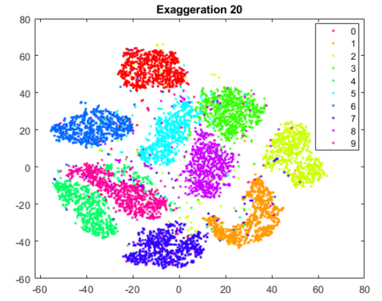

  

PCA (主成分分析)と呼ばれる方法を用いて、次元圧縮を行い、上のような2次元や3次元上でのプロットを得ることもできます。しかし、主成分分析では、高次元空間上で線形的な構造を有しているものに対して、有効であり、非線形な構造を有しているデータに対しては、うまく低次元空間にマッピングできないという欠点があります。主成分分析については、以下の私の過去の記事をご覧ください。

[https://kentapt.hatenablog.com/entry/2022/02/16/182532](https://kentapt.hatenablog.com/entry/2022/02/16/182532)

本記事の執筆においては、以下のページを参考にさせていただきました。ありがとうございました。

  

**t-SNE 解説**

[https://qiita.com/sakami/items/bb466161489771f7d2e9](https://qiita.com/sakami/items/bb466161489771f7d2e9)

**Parametric t-SNEの理論とKerasによる実装**

[https://qiita.com/koshian2/items/7aab45dafbdbd959d8fc](https://qiita.com/koshian2/items/7aab45dafbdbd959d8fc)

**t-SNE を用いた次元圧縮方法のご紹介**

[https://blog.albert2005.co.jp/2015/12/02/tsne/](https://blog.albert2005.co.jp/2015/12/02/tsne/)

  

この記事では、初めにt-SNEについて簡単にまとめ、その後、パラメータをいくつか変えながらt-SNEについて勉強していこうと思います。

# 2章 t-SNEについての自分用まとめ

ここからは、t-SNEの処理の流れについておおまかにまとめていきます。より正しい/詳しい解説にて勉強したい方は上の参考ページをご覧ください。

## 2.1. t-SNEの目標

n次元上に複数の点が存在するといます。その空間上の任意の点のペアを作り、それらを2次元平面（や3次元空間）に写像したときのことを考えます。

(i) 近い点：2次元平面（や3次元空間）に点を写像したときも、それらの点が**近い**ままにする

(ii) 遠い点：2次元平面（や3次元空間）に点を写像したときも、それらの点が**遠い**ままにする

(i) (ii)のように、高次元と低次元空間上で、それらの点の近さの関係をできるだけ保つようにしていきます。まずは、2.2で、この近さについてどのように定義していくかについて述べていきます。

## 2.2. 近さ（類似度）の定義について
### 2.2.1. 高い次元の場合

高い次元の空間（高次元空間）での任意の点どうしの距離を、正規分布に従う確率分布でモデル化します。

はじめに、正規分布の確率密度関数の式は以下のように表すことができます。

 

...(1)

そもそも、なぜ確率密度関数の式がこのようになるのか、ということについては、以下のページがわかりやすかったです。

[https://ai-trend.jp/basic-study/normal-distribution/density-function-derivation/](https://ai-trend.jp/basic-study/normal-distribution/density-function-derivation/)

  

ここで、2つの点、 と を考えます。先ほどの、正規分布の確率密度関数の式をもとに、以下のように近さ（類似度）を表してみます。

直感的には、分母で、全てのペアの距離を足して、それで割ることで正規化しています。確率密度関数の式のexpの直前の値は、分母分子で共通しているのでキャンセルされています。


...(2)

はユーザーの指定する必要があります。

上で定義した近さについては、SNEと呼ばれる、t-SNEのもととなった手法での近さを示しています。t-SNEでは、近さを以下のように定義します。


はデータ数を示します。

そのため、t-SNEにおいては、


であると言うことができます。ひとまず、高次元空間の任意の点の距離を正規分布の確率密度関数の式をもとに、定義しました。

  
### 2.2.2. 低い次元の場合

低次元空間上の類似度を以下のStudentのt-分布(自由度1)で表現します


...(3)

ここで、t分布の一般式は以下のとおりです。


を含まない部分は、分母と分子で共通するためキャンセルされます。残ったには1を代入し、に$y_k -y_l$を代入すると上の式になることがわかります。

高次元空間上では、正規分布を使った一方で、ここでは、t分布を用いています。その理由については、Crowing problemがあるそうです。元の論文にも記述されていますが、以下のブログの解説がわかりやすかったです。

  
## 2.3. 高次元空間上の点を低次元空間上に写像するときの考え方

高次元空間上および写像後の点の近さ（遠さ）を保てるようにするため、KLダイバージェンスを用います。

KLダイバージェンスを用いた損失関数としては、以下のようなものを用います。


....(4)

ここでは、点 i と点 jの、高次元空間と低次元空間上の距離が似ている（割り算すると1になる）ほど、logの中身が1に近づきます。それにより、式xxの値自体も0に近づきます。

勾配法によって、低次元空間に写像する点を少しずつ変化させていき、KLダイバージェンスの値をどんどん小さくしていきます。

## 2.4. KLダイバージェンスの式の微分について

式ｘｘで示した、KLダイバージェンスの式を微分していきます。

先ほど示したような、以下の式を微分するために、logの中身を展開していきます。


  


...(5)

ここで、式ｘｘの通り、


  

でした。

とすると、この式は


  

と表すことができます。さらに分母の値をとして


...(6)

とします。

これを用いると、式ｘｘは、


...(7)

と書き換えることができる。低次元空間上にマッピングしたときの値であるを求めるために、

低次元空間上のについて微分を行う。

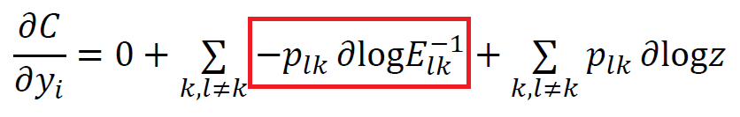

...(8)

第一項目は、yが含まれないため、0となる。

この式ｘｘの2項目について考える。

　および　 であることから、

ここで、


...(9)

とすることができる。

さらに、

なので、

（以下、式どうしに説明があったりして、スキャンした画像のまま掲載させてください）

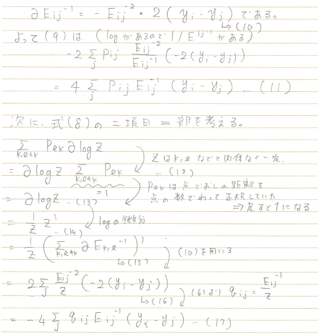

（スキャンした画像終わり）

(11)および(17)で計算した、(8)の第一項と第二項を足し合わせると、


...(18)

を得ることができる。


...(19)

となり、で微分すると、このようにきれいな式を得ることができました。

この式をもとに勾配法などで更新していくことで、2次元平面や3次元空間上に写像したの座標を求めることができます。

# **3章 t-SNEで遊んでみよう**

この章では、2章で簡単にまとめた、t-SNEいろいろ試してみたいと思います。以下の公式ドキュメントを参考にします。

[https://jp.mathworks.com/help/stats/tsne-settings.html](https://jp.mathworks.com/help/stats/tsne-settings.html)

# 3.1. データのダウンロード

以下の、THE MNIST DATABASE of handwritten digitsにあるデータをダウンロードします。以下のページにアクセスしてください。手書き数字のデータセットをダウンロードすることができます。以下の左下の赤枠をご覧ください。

[http://yann.lecun.com/exdb/mnist/](http://yann.lecun.com/exdb/mnist/)

  
  

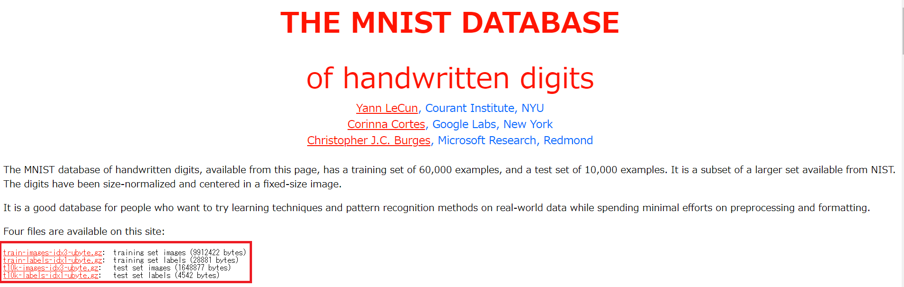

以下のような`train-`からはじまるファイルを2つダウンロードしてください。そして、7zipなどを用いて、ダウンロードした gz ファイルを解凍します。すると、以下のように`-ubyte`で終わるファイルを2つ得ることができます。

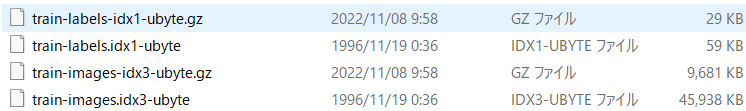

```matlab:Code
imageFileName = 'train-images.idx3-ubyte';
labelFileName = 'train-labels.idx1-ubyte';
```

`processMNISTdata.m`というコードを用いて、t-SNEによる解析を行うための前準備を行います。

```matlab:Code
[X,L] = processMNISTdata(imageFileName,labelFileName);
```

```text:Output
Read MNIST image data...
Number of images in the dataset:  60000 ...
Each image is of 28 by 28 pixels...
The image data is read to a matrix of dimensions:  60000 by  784...
End of reading image data.

Read MNIST label data...
Number of labels in the dataset:  60000 ...
The label data is read to a matrix of dimensions:  60000 by  1...
End of reading label data.
```

計算時間短縮のため、以下のコードでサンプルを減らします。必要なければ、===で囲まれた範囲をコメントアウトしてください

```matlab:Code
% =============
idx = randperm(numel(L),round(numel(L)*0.1));
X = X (idx,:);
L = L(idx);
% =============
```

画像がどのようなものか確認します。以下のように手書き数字のデータセットであることが確認できます。

```matlab:Code
dispIdx = randperm(numel(L),9);
dispCell = cell(9,1);
for i=1:9
    X_i = X(dispIdx(i),:);
    dispCell{i} = reshape(X_i,[28 28]);

end
figure;montage(dispCell)
```

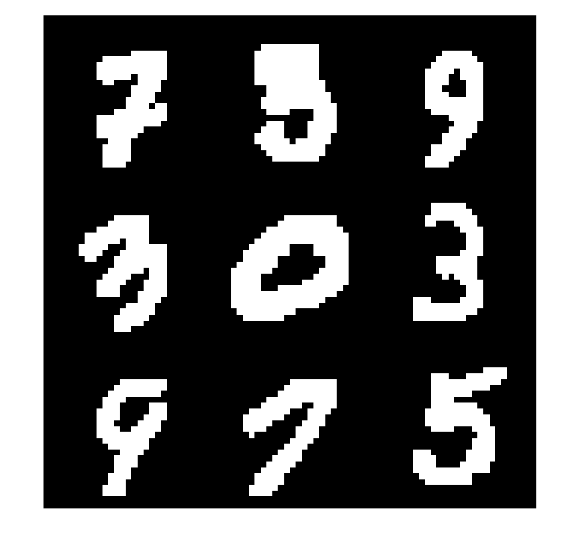

## 3.2 t-SNEによる次元圧縮

さっとく、さきほどの手書き数字のデータセットをt-SNEを用いて解析し、2次元平面にデータをプロットしたいと思います。t-SNE関数を用いて簡単に実行することができます。

   -  Barnes-Hutアルゴリズムを用いて、大規模なデータを効率的に処理します 
   -  主成分分析（PCA）を用いて、次元を784から50に削減してから、t-SNEを実行します。主成分分析については、以下の私の過去の記事をご覧ください。 

[https://kentapt.hatenablog.com/entry/2022/02/16/182532](https://kentapt.hatenablog.com/entry/2022/02/16/182532)

```matlab:Code
rng default % for reproducibility
% t-SNEの実行時間を計測
tim = tic;
Y = tsne(X,'Algorithm','barneshut','NumPCAComponents',50,'Perplexity',30);
toc(tim)
```

```text:Output
経過時間は 176.732598 秒です。
```

```matlab:Code
numGroups = length(unique(L));
% クラス数に従い、色を定義
clr = hsv(numGroups);
% 可視化
figure;gscatter(Y(:,1),Y(:,2),L,clr);title('Default Figure')
```

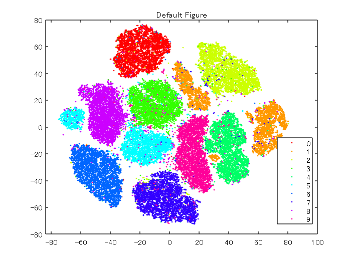

t-SNEを用いて、各数字をクラスタに分けることができました。比較的、ミスしている点も少なく、きれいに可視化できていることがわかります。

## 3.3. パラメータの変更
### 3.3.1. Perplexityについて

以下のように、Perplexityの値を変更していきます。パープレキシティが大きくなると、`tsne` はより多くの点を最近傍として使用します。データセットが大きい場合は、`Perplexity` の値を大きくします。一般的な `Perplexity` の値の範囲は、5 ～ 50 だそうです。

```matlab:Code
rng default % for fair comparison
Y50 = tsne(X,'Algorithm','barneshut','NumPCAComponents',50,'Perplexity',50);
figure
gscatter(Y50(:,1),Y50(:,2),L,clr)
title('Perplexity 50')
```

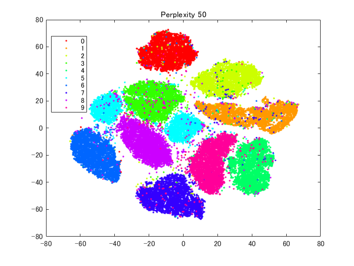

```matlab:Code
rng default % for fair comparison
Y4 = tsne(X,'Algorithm','barneshut','NumPCAComponents',50,'Perplexity',4);
figure
gscatter(Y4(:,1),Y4(:,2),L,clr)
title('Perplexity 4')
```

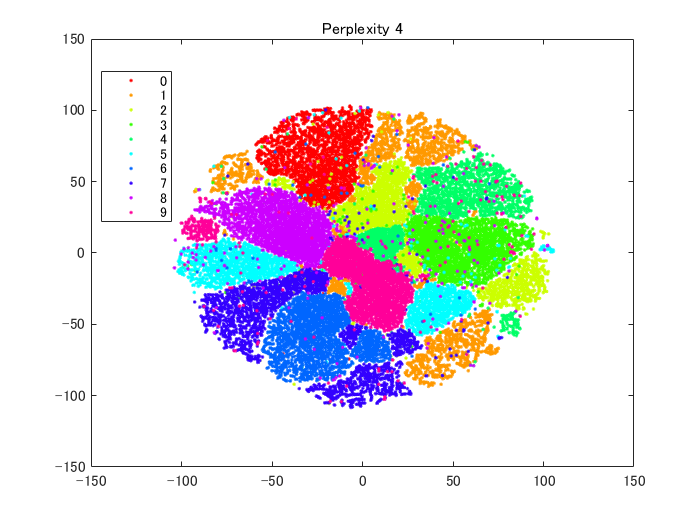

perplexityを50に設定した場合は、比較的、はじめの図と似ていると思います。一方、4にすると、各クラスターが込み合ったような図になっています。

### 3.3.2. Learning Rate（学習率）について

次に、学習率を変えて比較したいと思います。

以下のコマンドでは、学習率を5に設定します。

```matlab:Code
rng default % for fair comparison
YL5 = tsne(X,'Algorithm','barneshut','NumPCAComponents',50,'LearnRate',5);
figure
gscatter(YL5(:,1),YL5(:,2),L,clr)
title('Learning Rate 5')
```

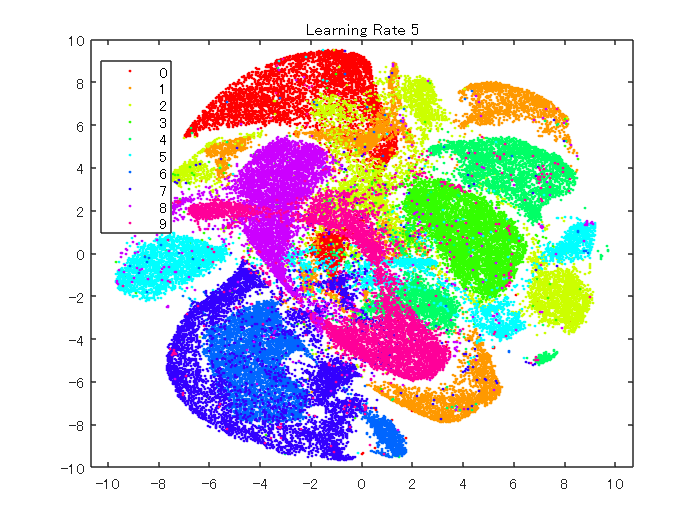

次に学習率を2000に設定します。

```matlab:Code
rng default % for fair comparison
YL2000 = tsne(X,'Algorithm','barneshut','NumPCAComponents',50,'LearnRate',2000);
figure
gscatter(YL2000(:,1),YL2000(:,2),L,clr)
title('Learning Rate 2000')
```

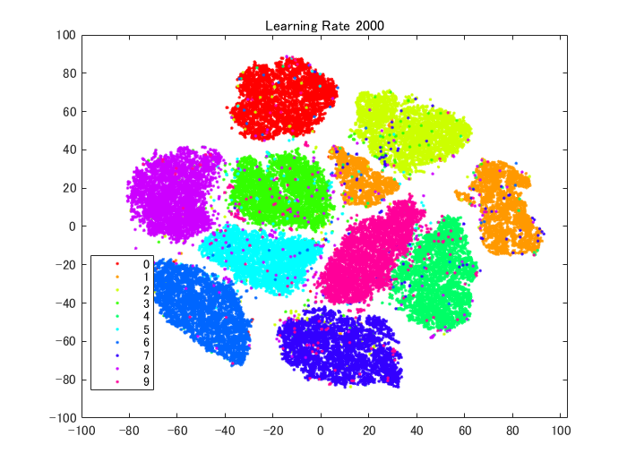

以上のように、学習率を変えると、また異なる結果を得ることができました。データによるため一概には言えませんが、学習率が小さすぎると、最適な解にたどり着けず、十分分離されていない結果が得られると思います。一方、大きすぎても、最適な場所に解が落ち着かないため、きれいな分離結果を得ることができません。

# 4章 簡単なまとめと注意点

**簡単なまとめ**

この記事では、t-SNEの仕組みを簡単に説明し、さらにMATLABを用いて、その動作を確認しました。Perplexityや学習率などのパラメータがあり、それらの設定によって結果が異なることがわかりました。

**その結果を使用して新しいデータを分類することはできない**

多くの場合に t-SNE はデータをクラスターにきれいに分離するので、新しい手元のデータにも試したくなります。しかし、t-SNE は新しいデータ点をクラスターに分類できません。t-SNEによるマッピングは、データに依存する非線形写像で、新たに低次元空間に新しい点を埋め込むためには再度その点を含めてt-SNEを実行しなおす必要があります。一方主成分分析（PCA）による方法では、マッピングするための重みなどが求まるため、新たなデータに対しても適用することができます。

  
# 参考ページ（本文中に記載のないもの）

1 Yann LeCun (Courant Institute, NYU) and Corinna Cortes (Google Labs, New York) hold the copyright of MNIST dataset, which is a derivative work from original NIST datasets. MNIST dataset is made available under the terms of the Creative Commons Attribution-Share Alike 3.0 license, [https://creativecommons.org/licenses/by-sa/3.0/](https://creativecommons.org/licenses/by-sa/3.0/)

2 MATLABドキュメンテーション：t-SNEとは

[https://jp.mathworks.com/help/stats/t-sne.html\#bvkoln8-1](https://jp.mathworks.com/help/stats/t-sne.html#bvkoln8-1)
